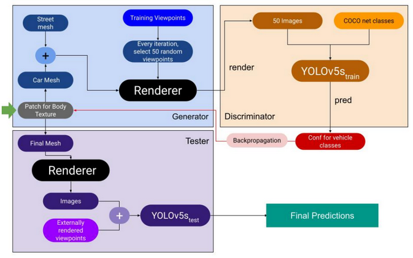

# Adversarial Attack on Object Detectors (2023)
This repo contains code written (from scratch, by me) for my Post-A Level research internship: *Real World Adversarial Attacks and Defence on Deep Neural Networks*.

The way this was achieved was to establish a PyTorch autograd generator and a discriminator (either Yolov5 trained on COCO or VisDrone, labelled Yolov5s_train). The idea was to pass PyTorch3D-rendered structures through the discriminator using a randomly initialised texture, and for the PyTorch autograd to backpropagate the gradients from the discriminator loss back to the generator, in turn perturbating the trained texture in the direction of minimal loss. The final texture is then evaluated on a test discriminator (again either Yolov5 trained on COCO or VisDrone).

The purpose of mixing COCO and VisDrone-trained Yolov5s was to additionally investigate if cross-training on one Yolov5 model could yield results for the other, that is, if the attacking texture was generalisable to some extent.
